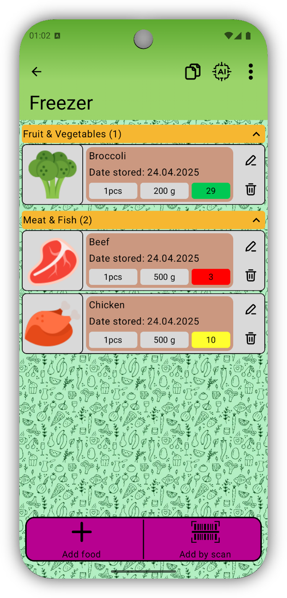

# 🧊 FridgeTracker

**FridgeTracker** is an Android app for managing food storage in your fridge and freezer. It helps you track expiration dates, get notifications before food goes bad, and share your storage with others.

## 📱 Key Features

- 🏠 **Create a storage** – user can create a new storage with a custom name and optional description.
- ✏️ **Edit storage** – user can rename storage, assign an icon, and change its order in the app.
- 🥫 **Add food manually** – includes name, category, quantity, weight, barcode, photo, expiration date, added date, and notes.
- 📷 **Add via barcode** – scanning a barcode autofills available food data.
- 🔄 **Edit food item** – allows changes to existing food details.
- ⏰ **Expiration notifications** – automatic alerts for soon-to-expire foods.
- 🛒 **Shopping list** – move items between shopping list and storage.
- 🔍 **Search** – find foods across all storages by name or barcode.
- 📦 **Food management** – copy, move or delete food items between storages.
- 📊 **Expiration visualization** – clear visual indicator of days remaining.
- 🔃 **Sorting** – sort items by expiration date, name or quantity.
- 🎴 **Card layout customization** – choose detailed or compact food card style.
- 📅 **Notification settings** – choose how many days before expiration to be notified.
- 🤖 **AI prompt builder** – generate text prompts (e.g. recipe suggestions) based on your current storage.
- 👥 **Shared storage** – invite other users to view or edit your food storage.

## ⚙️ Non-functional Requirements

- 📱 **Device support** – The app is fully functional on Android 8.0 (API 26) and higher.
- 🌍 **Localization** – Supports both Czech and English, matching the system language settings.
- 🔐 **Data security** – All user data is stored locally and is not accessible to third parties.
- 🧑‍💻 **User-friendliness** – The UI is clear, intuitive, and suitable even for less tech-savvy users.
- 📴 **Offline mode** – The app works offline, including adding and editing food items.
- ⚡ **Performance and stability** – The app runs smoothly even on average devices, with no major lags or crashes.

## 🖼️ UI Previews

  
  

  <em>My Storages</em> &nbsp;&nbsp;&nbsp;&nbsp; <em>Storage Detail</em>

## 🏗️ Technologies Used

- 🧠 Jetpack Compose (UI)
- 🗃️ Room database
- 📦 MVVM architecture
- 🔔 Notifications
- 📸 Photo and barcode support
- 🌐 Localization (CZ / EN)

## 🚧 Status

This app is still under development. Some features might be experimental. Feedback is welcome! ✨

## 🛡️ Licence

This project is for demonstration and educational purposes. [MIT licencí](LICENSE).
