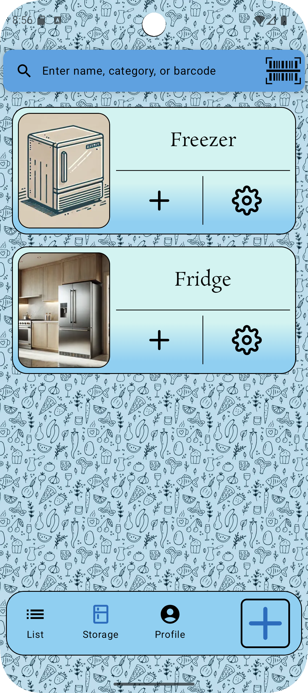
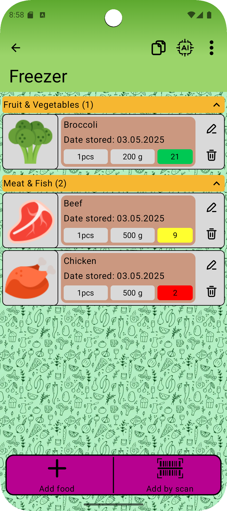

## 🇬🇧 FridgeTracker – Food Inventory Management App

### 🫒 Description
FridgeTracker is an Android mobile app that helps users manage food stored in multiple locations (like fridges and freezers) and notifies them before expiration. Its goal is to reduce food waste and simplify home food tracking.

### ✨ Main Features
- Add and manage multiple storage locations (fridge, freezer…)
- Notifications about upcoming expiration dates
- Add food via barcode scanning or custom photos
- Share storage with other users
- Shopping list linked to your storage
- Purchase history and food statistics
- Filtering, sorting, and search support
- Fully localized in Czech and English

### 🛠️ Tech Stack
- Kotlin, Jetpack Compose
- Room (SQLite)
- WorkManager for notifications
- MVVM architecture
- Barcode scanning (ML Kit)
- Accompanist libraries (permissions, animations)
- Localization via `strings.xml`

### 📱 Screenshots *(optional – add yours)*

  
  

### 🛒 Installation
Currently available for internal testing only. Access via Google Play test link:

👉 [Tester access](https://play.google.com/apps/test/cz.filip.fridgetracker_001/2)

### ⚖️ License
This app is licensed under the MIT License.
